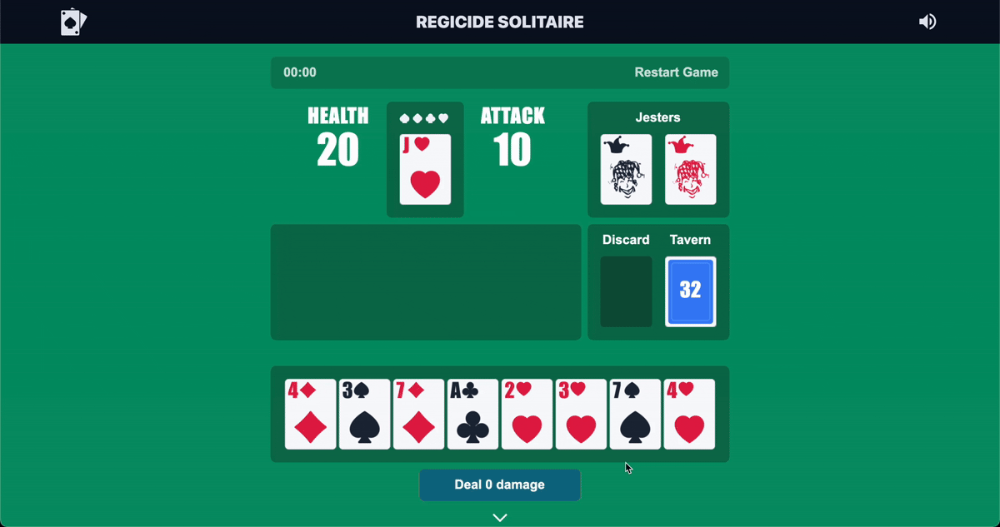

# playcardsgames

A **Svelte-based** web application for playing card games. Styled with **Tailwind CSS** and built using **Vite**. This project includes a simple UI, interactive animations, and full build and deployment pipelines.



##  Live Demo

https://play1card1games.netlify.app/

##  Table of Contents

- [Features](#features)
- [Tech Stack](#tech-stack)
- [Installation](#installation)
- [Usage](#usage)
- [Project Structure](#project-structure)
- [Build & Deployment](#build--deployment)
- [Contributing](#contributing)
- [License](#license)
- [Acknowledgments](#acknowledgments)

---

## Features

- Interactive card game interface powered by **Svelte**
- Responsive design with **Tailwind CSS**
- Development tooling via **Vite**
- Static site deployment ready (e.g., Netlify)

## Tech Stack

| Feature              | Description                         |
|----------------------|-------------------------------------|
| Framework            | Svelte (via `create-svelte`)        |
| Styling              | Tailwind CSS                        |
| Build Tool           | Vite                                |
| Configuration files  | ESLint, Prettier, PostCSS           |

## Installation

1. **Clone the repository**

   ```bash
   git clone https://github.com/rabiibouhestine/playcardsgames.git
   cd playcardsgames
   ```

2. **Install dependencies**

   ```bash
   npm install
   # or
   # pnpm install
   # or
   # yarn
   ```

## Usage

- **Start the development server:**

  ```bash
  npm run dev
  # or
  # npm run dev -- --open  (to open directly in browser)
  ```

- **Build for production:**

  ```bash
  npm run build
  ```

- **Preview the production build locally:**

  ```bash
  npm run preview
  ```

## Project Structure

```
.
├── dist/                # Production build output
├── src/                 # Source code (Svelte components, assets)
├── static/              # Static assets
├── .eslintignore        # ESLint ignore configuration
├── .eslintrc.cjs        # ESLint configuration
├── .prettierignore      # Prettier ignore configuration
├── .prettierrc          # Prettier configuration
├── netlify.toml         # (Optional) Netlify deployment configuration
├── package.json         # Project dependencies & scripts
├── postcss.config.js    # PostCSS configuration
├── svelte.config.js     # SvelteKit configuration
├── tailwind.config.js   # Tailwind CSS configuration
└── vite.config.js       # Vite configuration
```

## Build & Deployment

- **Build**: `npm run build` generates optimized assets in `dist/`.
- **Deploy**:  
  - If using **Netlify**, the included `netlify.toml` should streamline deployment.  
  - Alternatively, you can deploy to **Vercel**, **GitHub Pages**, or any static hosting provider.

## Contributing

Thank you for considering contributing!  
To contribute:

1. Fork the repository.  
2. Create a branch: `git checkout -b feature/YourFeature`.  
3. Make your changes and commit them.  
4. Push to your fork and open a PR—even improvements like typing, documentation, or bug fixes are welcome!

## License

This project is licensed under the **MIT License**. Feel free to modify as needed to reflect your actual license or situation.

## Acknowledgments

- Generated using [`create-svelte`](https://github.com/sveltejs/kit) ([github.com](https://github.com/rabiibouhestine/playcardsgames))  
- Design inspired by the Svelte and Tailwind ecosystems.
